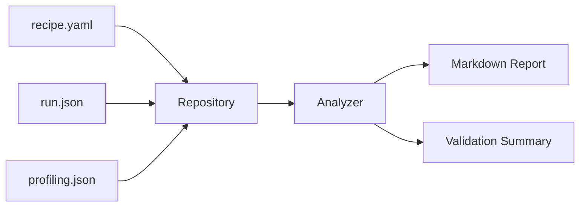

# Architecture

## 目标

把当前文档中的闭环设计沉淀成一套能继续扩展的代码结构，而不是停留在一次性 demo。

## 核心模块

### `recipes`

负责样例定义。

V1 至少包含：

1. 基本信息
2. 环境信息
3. 入口信息
4. 外部依赖
5. 输出目录
6. profiling 挂接信息
7. 验证指标

### `repository`

负责从磁盘加载：

1. recipe 描述
2. run 记录
3. profiling 记录

### `analyzer`

负责把 profiling 信号和 run 指标转成：

1. 问题摘要
2. 优化建议
3. 预期收益
4. 验证摘要

### `reporting`

负责统一输出：

1. discovery 列表
2. 分析报告
3. 迁移方案
4. 规范校验结果

## 最小数据流

## 下一步应该加什么

1. 真实 external recipe adapter
2. 真正的 profiling 采集挂接
3. 自动规则库与标签系统
4. 跨模型共性问题归因
5. 面向 CANN/芯片规划的聚合输出

## 为什么这套结构适合做迁移参考

它把“迁移一个模型”拆成了几件明确的事：

1. 用 `recipe.yaml` 描述样例资产。
2. 用 `run.json` 描述一次基线或优化运行。
3. 用 `profiling.json` 描述关键性能信号。
4. 用 `validate` 检查接入是否完整。
5. 用 `report` 生成统一摘要。

这意味着未来新增模型时，不需要先理解整个平台，只需要先满足最小闭环。
