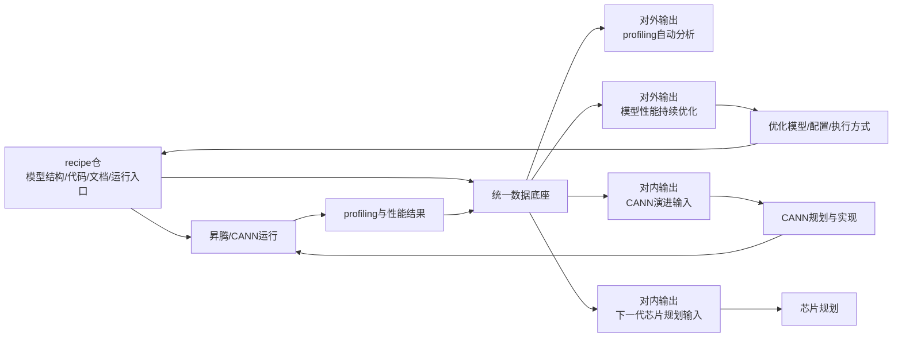
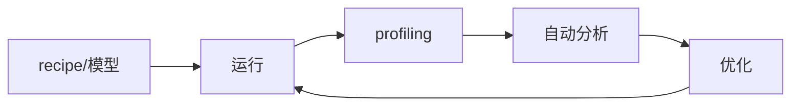
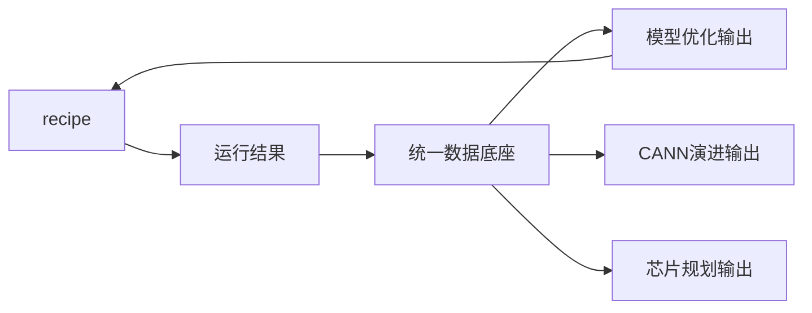

# 基于昇腾/CANN的模型分析工具

## 1. 项目目标

做一个围绕昇腾和 CANN 的闭环分析工具，用同一套数据同时支撑模型优化、CANN 演进和芯片规划。

1. 对外：自动分析 profiling，持续优化模型性能。
2. 对内：识别当前代 CANN 的能力缺口。
3. 对内：识别下一代芯片需要补的规格和功能。

核心不是做一次性分析，而是把“模型资产、运行结果、分析结论、优化验证”串成可持续迭代的机制。

---

## 2. 整体闭环

这张图表达的是一件事：

以 `recipe` 为入口，以运行结果为核心，以统一数据底座为中枢，对外做模型优化，对内支撑 CANN 和芯片演进。

---

## 3. 对外能力

对外只突出两个能力：

1. `profiling` 自动分析。
2. 模型性能持续优化。

对外输出：

1. 瓶颈在哪里。
2. 应该怎么优化。
3. 优化前后差了多少。
4. 下一轮优化还可以继续从哪里入手。

---

## 4. 对内能力

对内沉淀两个方向的结果：

1. CANN 演进输入。
2. 下一代芯片规划输入。

一句话说，对内做的是共性问题归纳，不是单模型调优。

重点是把多个模型、多个版本、多个 profiling 结果里的重复问题，逐步沉淀为软件和芯片层面的规划依据。

---

## 5. 数据底座

需要一个统一数据底座，把下面几类数据关联起来：

1. 模型结构文件。
2. 模型描述文档。
3. 模型结构代码和运行代码。
4. profiling 数据和性能结果。

作用只有一句话：

把“模型资产 -> 运行结果 -> 分析结论 -> 优化验证”串起来。

后续无论是看单模型优化、看 CANN 共性问题，还是看芯片瓶颈趋势，都要建立在这套统一数据之上。

---

## 6. recipe 的角色

`cann-recipes-infer`、`cann-recipes-train`、`cann-recipes-spatial-intelligence`、`cann-recipes-embodied-intelligence` 是第一阶段最重要的起点。

recipe 在闭环里承担四个角色：

1. 原始输入源。
2. 运行起点。
3. 优化载体。
4. 验证载体。

也就是说，recipe 不是外部补充材料，而是整个闭环的入口、载体和回灌点。

---

## 7. 两层闭环

### 小闭环

围绕功能 1，持续优化单模型性能。

### 大闭环

围绕功能 1、2、3，把模型优化、CANN 演进、芯片规划串起来。

小闭环解决的是“单模型怎么持续变快变好”，大闭环解决的是“从单模型经验里，怎么反推出软件和芯片下一步该做什么”。

---

## 8. 价值

做这件事的价值：

1. 对外，把 profiling 解读能力产品化，把模型优化能力闭环化。
2. 对内，把单模型问题沉淀成 CANN 的共性需求。
3. 对内，把软件和算法瓶颈转成下一代芯片规划输入。

做成之后，模型优化不再依赖一次次手工排查，CANN 和芯片规划也不再只靠经验判断，而是能逐步建立在真实模型和真实运行数据之上。

---

## 9. 现状判断

已有基础：

1. 一批 `cann-recipes-*` 仓。
2. 部分模型、代码、文档和运行入口。

关键缺口：

1. 统一数据底座。
2. 标准化运行和 profiling 采集。
3. 自动分析规则。
4. 优化验证机制。
5. 从单模型结论上升到 CANN 和芯片结论的归纳能力。

---

## 10. 一句话定义

这是一个以 `recipe` 为入口、以 profiling 和运行结果为核心、对外做模型优化、对内支撑 CANN 和芯片演进的闭环分析工具。
